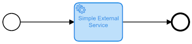
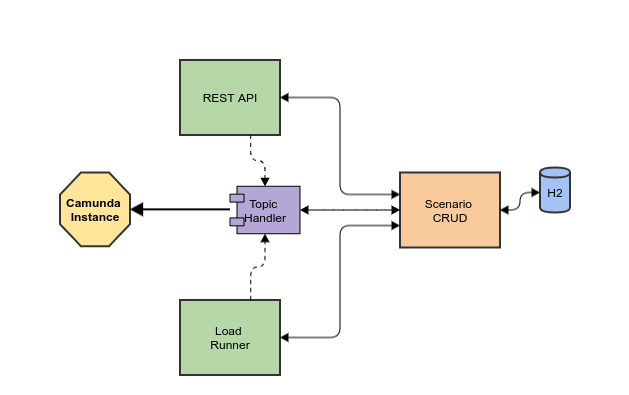

[](https://codecov.io/gh/ricardo-comar/camunda-mock-service)
# Camunda External Service Mock

Project created, while learning the Camunda BPMN tool, to accelerate the flow tests created to exercise the learned stereotypes. A second project is also under development [here](https://github.com/ricardo-comar/spring-boot-camunda), to recreate a real life (!?) scenario and using real (!?!?!?) components.

When showing more evolved, it was used to create a regressive test suite of the models, allowing the flow to continue flowing when using External Tasks. 
A simple practical example is [here](sample-project/README.md).

## Usage

### Basic Structure

The component is responsible to handle a topic message and provide a response (or more) to be saved on message, to carry on to the next step on business flow.

Each scenario has a structure based on **condition**, **priority** and **variables**:
```javascript
{
  "topicName": "topicSimple", // Name defined on BPMN element
  "priority": 10, // Order for more than one scenarios on same topic
  "condition": { // Condition to be executed
      "conditionScript": "return true" // Groovy script
  },
  "variables": [ // List of variables to be saved/updated on message
    {
      "name": "messageApproved", // Variable name
      "className": "java.lang.Boolean", // Java class with String constructor
      "value": "true", // Value to be set
      "groovyScript" : "return id == 123" // Groovy Script, can access message variables by name
    }
  ]
}
```
#### Rules
- One scenario **must** define _topicName_, _priority_, _condition_ and 1+ _variables_.
- You cannot define two scenarios with the same _topicName_ and _priority_. 
- _conditionScript_ **must return boolean**, and you can use message variables to define that.
- _groovyScript_ **must return something**, including _null_.
- A _variable_ must be defined with (_className_ **and** _value_) **OR** (_groovyScript_). Neither none of them.


#### Scenario Matching
- When a message arrives on the "on demand" topic handler, it gets the _topic_ definition and queries the registred scenarios for that.
- If no scenario is found, a __Failure__ is generated with error code _SCENARIO_ABSENT_.
- Every scenario has his _condition_ evaluated. If no condition is matched, a __Failure__ is generated with error code _MATCHING_CONDITION_ABSENT_.
- If more than one scenario is matched, the lowest_priority_ is used to identify the desired scenario. 

### Running

You must define the property "camunda.engine.url" to the REST API of your Camunda server (ex: -Dspring-boot.run.arguments="--camunda.engine.url=http://localhost/engine-rest"). You can add any other Spring Boot properties (like "server.port") you wish.

You can run with _mvn spring-boot:run_ 
Or _java -jar target/camunda-mock-service-1.0.0-SNAPSHOT.jar_

## Registering Scenarios

There's two ways to register a scenario, on warmup or by demand

### 1 - On Warmup

When Spring Boot starts, it searches for a folder named (by default) _scenarios_ on executing path.
Every file found will be loaded by the same rules described on [Rules](#Rules) topic to register a **Scenario**.
I suggest the pattern **{topicName}-{priority}.json**

### 2 - By Demand

A REST API is available to register Topic Listeners, and  insert, update or remove scenarios, and is also accessible by a Swagger Interface on http://localhost:8099/swagger-ui/.


## Under the hood



### Topic Handler

It's the main component, responsible to connect to the **Camunda Instance** to keep pooling the desired topic for new messages. It uses the [Camunda External Task Client](https://github.com/camunda/camunda-external-task-client-java) to make the connection.
Every time a message arrives, it queries for all scenarios available for that topic (described on [Scenario Matching](#Scenario_Matching)), and executes the mathed one.

### REST API

Component responsible to save, update or delete the scenarios, and register the topic handler by demand.

### Load Runned

Component to load the scenarios and register topics on warmup.

### Scenario CRUD

Core of the component, to maintain the Scenarios, validating the inclusions and saving in an on memory database (H2).


# Upcoming
- Generate custom **failure** or **BPMN Error**.
- Multiple conditions
- Test groovy compilation on scenario creation

# References
- https://stackoverflow.com/questions/59203704/how-create-a-badge-with-test-coverage-jacoco-on-github-actions
- https://www.baeldung.com/swagger-2-documentation-for-spring-rest-api
- https://camunda.com/download/modeler/
- https://www.infoq.com/articles/events-workflow-automation/
- https://camunda.com/best-practices/_/
- https://camunda.com/best-practices/handling-data-in-processes/
- https://github.com/camunda/camunda-external-task-client-spring-boot
- https://forum.camunda.org/t/starting-new-process-instance-from-another-process-messages/3657/2
- https://docs.camunda.org/javadoc/camunda-bpm-platform/7.6/org/camunda/bpm/engine/RuntimeService.html
- https://camunda.com/best-practices/invoking-services-from-the-process/#_understanding_and_using_strong_external_tasks_strong